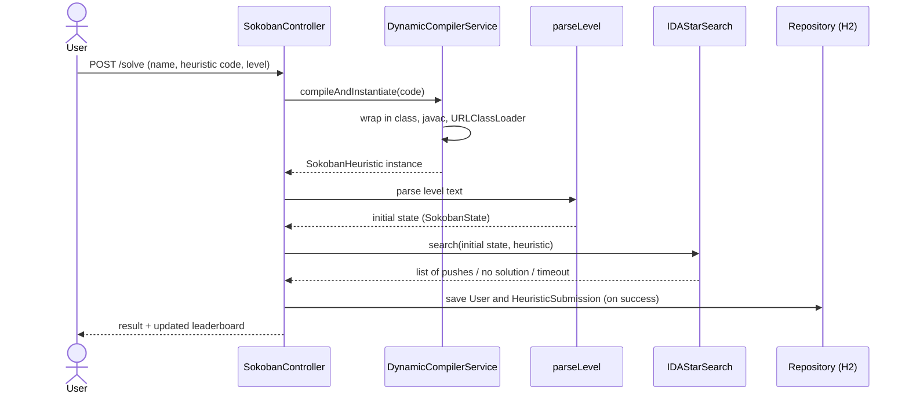

# Sokoban AI – Heuristic Submission Platform with an IDA* Solver

A web application where users can write their **own Java heuristic** for the Sokoban puzzle. The server **compiles the submitted code at runtime, loads it, and injects it into an IDA\* search**, which then looks for a solution to the selected level. Results are shown on a live leaderboard.

The project was built as a university assignment for an *Artificial Intelligence* course, based on one of the offered topics: a website where users can submit a Sokoban state-evaluating `int heur(SokobanState)` method, the site injects this heuristic into the search to solve levels, and ranks the users' heuristics by performance.

> The user interface is in Hungarian.

---

## Table of Contents

- [Features](#features)
- [Tech Stack](#tech-stack)
- [Architecture](#architecture)
- [How It Works](#how-it-works)
- [Results on the 155 Levels](#results-on-the-155-levels)
- [Getting Started](#getting-started)
- [Writing Your Own Heuristic](#writing-your-own-heuristic)
- [Level Format](#level-format)
- [Known Limitations and Future Improvements](#known-limitations-and-future-improvements)
- [Use of Generative AI](#use-of-generative-ai)
- [Acknowledgements](#acknowledgements)

---

## Features

- **Submit a heuristic from the browser** – the body of an `int heur(SokobanState state)` method, written in Java, as plain text.
- **Dynamic compilation and loading** – the Java Compiler API (`javax.tools`) compiles the code, a dedicated `URLClassLoader` loads it, and it is instantiated via reflection.
- **IDA\* search with macro operators** – the solver reasons in box pushes rather than individual player steps, which shrinks the search space considerably.
- **155 built-in levels** selectable from a dropdown, or paste any custom level in the text-based (XSB) format.
- **Time limit** – the search is aborted after 10 seconds, so a poor heuristic cannot block the server indefinitely.
- **Live leaderboard** – successful solutions (username, number of pushes, execution time, timestamp) are stored in the database and listed ordered by solution length.
- **H2 web console** – the database contents can be inspected from the browser.

## Tech Stack

| Area | Tool |
|---|---|
| Language | Java 21 (records, switch expressions, text blocks) |
| Framework | Spring Boot 3.2.3 – Spring Web (MVC), Thymeleaf, Spring Data JPA |
| Database | H2 (in-memory) |
| Dynamic code execution | Java Compiler API (`javax.tools.JavaCompiler`), `URLClassLoader`, Reflection |
| Build | Maven |
| UI | Thymeleaf template, HTML + CSS |

## Architecture

A classic layered Spring MVC structure:

```
src/main/java/org/example
├── SokobanApplication.java          # Spring Boot entry point + level text parsing
├── controller
│   └── SokobanController.java       # GET / (form), POST /solve (compile + search + persist)
├── service
│   ├── DynamicCompilerService.java  # compiles and instantiates the submitted code
│   └── LevelService.java            # loads the built-in levels from the classpath
├── model
│   ├── SokobanState.java            # state + macro operators (box pushes)
│   ├── IDAStarSearch.java           # the solver used by the web flow
│   ├── AStarSearch.java             # earlier step-level A* version (not used by the web flow)
│   ├── SokobanHeuristic.java        # interface implemented by submitted heuristics
│   ├── Position.java, Direction.java
│   ├── User.java                    # JPA entity (app_user table)
│   └── HeuristicSubmission.java     # JPA entity – one submission and its result
└── repository
    ├── UserRepository.java
    └── HeuristicSubmissionRepository.java

src/main/resources
├── application.properties           # H2 and JPA configuration
├── levels/original50.txt            # the 155 built-in levels
└── templates/index.html             # Thymeleaf UI
```

The lifecycle of a submission:



## How It Works

### State-Space Representation

The level is a grid whose cells are identified by `(x, y)` coordinates. Its elements fall into two groups:

- **static elements:** the set of walls (`W`) and the set of goal squares (`G`) – these never change during play;
- **dynamic elements:** the state `S = (p, B)`, where `p` is the player's position and `B` is the set of box positions.

**Goal state:** every box stands on a goal square, i.e. `B = G`.

The state (`SokobanState`) is immutable: applying an operator always produces a new state object. Two states are equal if the player position and the set of boxes match (`equals` / `hashCode`), so states can be used directly in a `HashSet` or `HashMap`.

### Macro Operators: One Push as One Step

A naive solver treats every player step (up/down/left/right) as a separate operator. This produces a huge search space, since most steps are just "walking" between two pushes.

This project instead treats **pushing a single box by one square** as the operator (`SokobanState.getValidPushes()`):

1. A breadth-first search (BFS) computes which squares the player can reach without pushing a box.
2. For every box and every direction it checks the **preconditions**:
   - the player can reach the square behind the box (on the opposite side),
   - the square the box would move to is neither a wall nor another box.
3. If both hold, the **effect** is: the box moves one square, and the player ends up on the box's previous square.

As a consequence, solution length is measured in **pushes**, and the path shown in the UI is also a list of pushes (e.g. `Tolás: (3,4) doboz RIGHT irányba`, meaning "Push: box at (3,4) to the RIGHT").

### IDA\* Search

Classic A\* keeps every visited state in its open and closed lists, which exhausts memory quickly in Sokoban. **IDA\* (Iterative Deepening A\*)** runs a depth-first search bounded by `f = g + h`, raising the bound on each iteration:

1. The initial bound is the heuristic value of the initial state.
2. Each iteration runs a depth-first search; branches where `f` exceeds the bound are cut off, and the smallest exceeding `f` value is recorded.
3. If no solution is found, that smallest exceeding value becomes the next bound.
4. If there is no exceeding value left, the level has no solution.

Additional techniques in the `IDAStarSearch` class:

- **cycle detection:** states on the current path are kept in a set, and the search never steps back onto them;
- **transposition table:** within an iteration, a `state → g` map records the cost at which each state has been reached; if the same state is reached again at no lower cost, that branch is pruned;
- **time limit:** after 10 seconds an exception is thrown, which the UI displays as an error message.

### Dynamic Code Loading

`DynamicCompilerService` inserts the submitted method into a class template:

```java
package org.example.dynamic;
import org.example.model.SokobanState;
import org.example.model.Position;
import org.example.model.SokobanHeuristic;

public class UserHeuristic implements SokobanHeuristic {
    @Override
    // <-- the submitted code goes here
}
```

It then:

1. writes the source to a temporary directory,
2. compiles it with `JavaCompiler` (the `-d` option creates the directory structure matching the package),
3. loads the class with a new `URLClassLoader`,
4. instantiates it via reflection and hands it to the solver as a `SokobanHeuristic`.

> Compilation requires a **JDK**; on a plain JRE, `ToolProvider.getSystemJavaCompiler()` returns `null`.

### The Built-In Default Heuristic

The heuristic pre-filled in the form combines two ideas:

- **corner deadlock detection:** if a box that is not on a goal is blocked by a wall both vertically and horizontally (it sits in a corner), it can never be moved out again, so the state gets a very large value (`100000`);
- **greedy matching with Manhattan distance:** each box "reserves" the nearest goal that is still free, and the sum of these distances is the estimate.

## Results on the 155 Levels

The solver core (state + IDA\* + default heuristic) was run separately from the Spring layer on all 155 built-in levels, with the built-in 10-second time limit:

| Number of boxes | Levels | Solved within 10 s |
|---|---|---|
| 1–3 | 74 | 72 |
| 4 | 46 | 32 |
| 5 | 19 | 6 |
| 6–16 | 16 | 6 |
| **Total** | **155** | **116 (75%)** |

- The median solve time for solved levels is **~25 ms**, and **95** of them are solved in under 1 second.
- The longest solution found is **175 pushes** (level 155, 11 boxes, about 0.5 s).
- 38 levels hit the time limit, mostly levels with 4+ boxes and narrow corridors, where corner-only deadlock detection is not enough.

> Test environment: single-core virtual machine, Java 21. Execution time measured in the web UI is higher, because it also includes compiling the submitted code.

These numbers show how strongly the quality of the heuristic affects performance – which is exactly what makes the leaderboard interesting: better deadlock detection or more accurate matching would bring the harder levels within reach.

## Getting Started

### Prerequisites

- **JDK 21** (a JRE is not enough, see above)
- **Maven 3.9+** (or an IDE's bundled Maven, e.g. IntelliJ IDEA)

### Running the Application

```bash
git clone https://github.com/<username>/<repo-name>.git
cd <repo-name>
mvn spring-boot:run
```

Then open **http://localhost:8080** in your browser.

In IntelliJ IDEA, simply open the project and run the `SokobanApplication` class.

### H2 Console

The database contents are available at **http://localhost:8080/h2-console**

| Field | Value |
|---|---|
| JDBC URL | `jdbc:h2:mem:sokobandb` |
| User Name | `sa` |
| Password | *(empty)* |

The database lives in memory, so the leaderboard is cleared whenever the application restarts.

## Writing Your Own Heuristic

The submitted code is a **single method** that starts with exactly this signature:

```java
public int heur(SokobanState state) {
    // ...
}
```

Helper methods may follow it (the template places the `@Override` annotation before the first method).

**Available API:**

| Call | Returns |
|---|---|
| `state.getBoxes()` | box positions (`Set<Position>`) |
| `state.getTargets()` | goal squares (`Set<Position>`) |
| `state.getWalls()` | walls (`Set<Position>`) |
| `state.getPlayer()` | player position (`Position`) |
| `pos.x()`, `pos.y()` | coordinates |

**Rules and notes:**

- The template only imports `SokobanState`, `Position` and `SokobanHeuristic`; everything else must be referenced by its fully qualified name (e.g. `java.util.List`, `org.example.model.Direction`).
- The return value is the estimated number of **pushes** left to reach the goal. If the estimate never exceeds the true value (an *admissible* heuristic), IDA\* finds a solution with the fewest pushes.
- For hopeless states (deadlocks), return a very large number so the search avoids that branch.

A minimal admissible example – the number of boxes not on a goal (each of them must be pushed at least once):

```java
public int heur(SokobanState state) {
    int count = 0;
    for (Position box : state.getBoxes()) {
        if (!state.getTargets().contains(box)) {
            count++;
        }
    }
    return count;
}
```

## Level Format

Levels use the standard text-based (XSB) Sokoban notation:

| Symbol | Meaning |
|---|---|
| `#` | wall |
| `@` | player |
| `$` | box |
| `.` | goal square |
| `*` | box on a goal |
| `+` | player on a goal |
| space | empty floor |

Example (the form's default level):

```
######
#@ $.#
######
```

The built-in levels are stored in `src/main/resources/levels/original50.txt`, separated by blank lines. The `Level N` line preceding each level is ignored by the parser.

## Known Limitations and Future Improvements

**Security.** Submitted code runs without a sandbox, in the same JVM as the server, so in principle it can do anything the server process can. For a locally run university project this is an accepted trade-off; in production the code would have to run in an isolated process or container with resource limits.

**Leaderboard.** The leaderboard currently sorts by number of pushes, but does not record which level a result was achieved on, so results from levels of very different difficulty end up in the same list. A better approach would be to periodically (e.g. with `@Scheduled`) run every heuristic on a fixed level set and rank them by number of levels solved, total pushes and execution time.

**Level parsing.** The parser treats the comment line preceding a level as part of the map. The `Level N` lines are harmless, but the period (`.`) in the title of level 154 is read as an extra goal square, so this level currently reports "no solution".

**Search efficiency.** Well-known Sokoban solver techniques that would make the harder levels reachable:

- normalizing the player position (e.g. to the top-left square of the reachable area), so states that represent the same situation collapse into one;
- precomputing "dead squares" (from which a box can no longer reach any goal), going beyond corner deadlocks;
- optimal matching (Hungarian algorithm) instead of greedy matching, which yields an admissible lower bound.

**Other.**

- The database is in-memory; all results are lost on restart.
- There is no registration or login; a user is created by name on their first submission.
- There are no automated tests yet; the 155-level benchmark above would be a good basis for a regression test.

## Use of Generative AI

The course explicitly encouraged the use of generative AI, provided it was documented. Development was assisted by Google Gemini, mainly for planning the architecture and for troubleshooting the dynamic compilation and class loading.

## Acknowledgements

- The built-in levels come from David W. Skinner's **Microban** collection.
- Theoretical background for state-space search: Stuart J. Russell, Peter Norvig: *Artificial Intelligence: A Modern Approach*.
